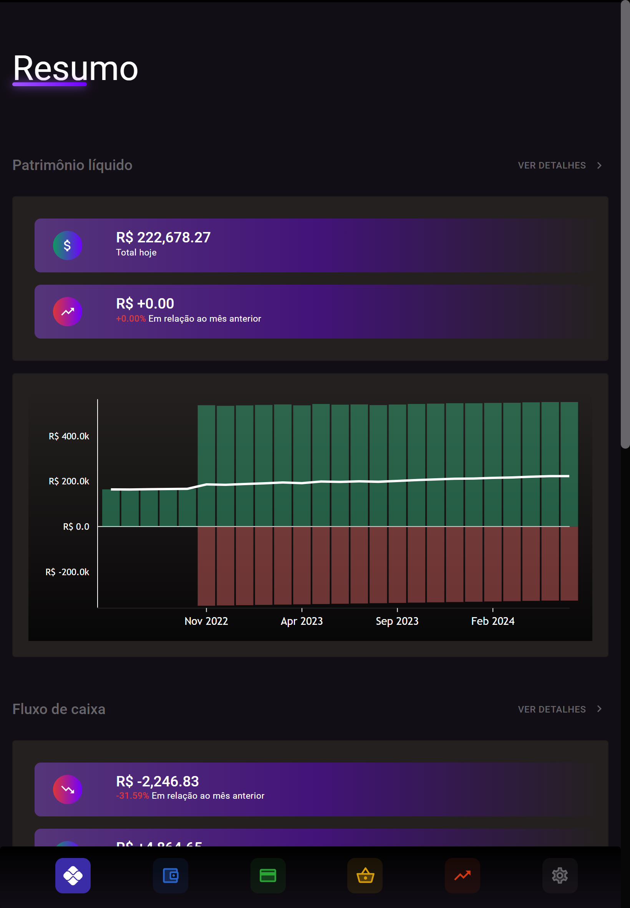

  

# Capivara

Capivara é um aplicativo simples de finanças pessoais do tipo local-first, onde é possível acompanhar e lançar movimentações manualmente, assim como importar extratos e planilhas financeiras.

# Screenshots

  

